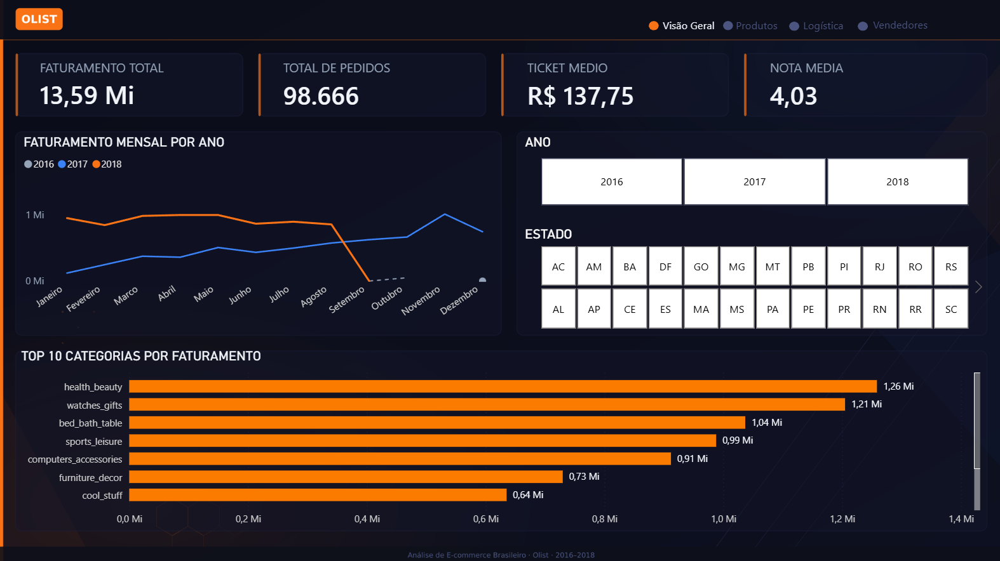
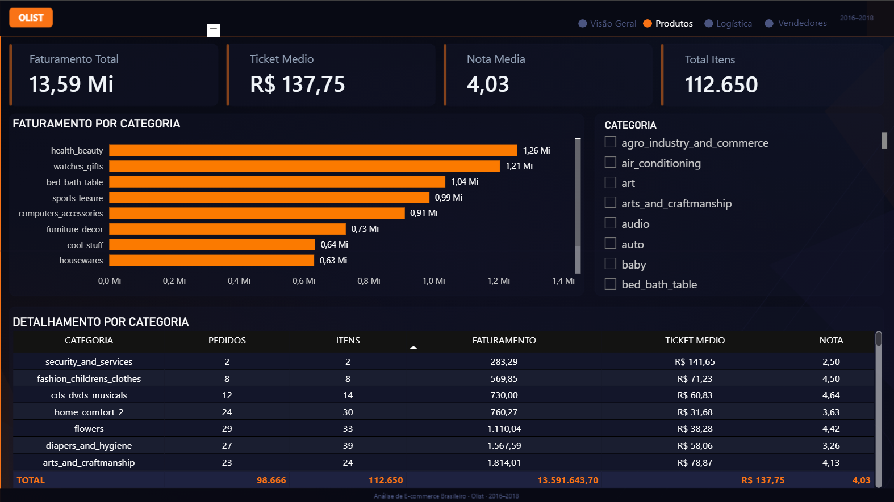
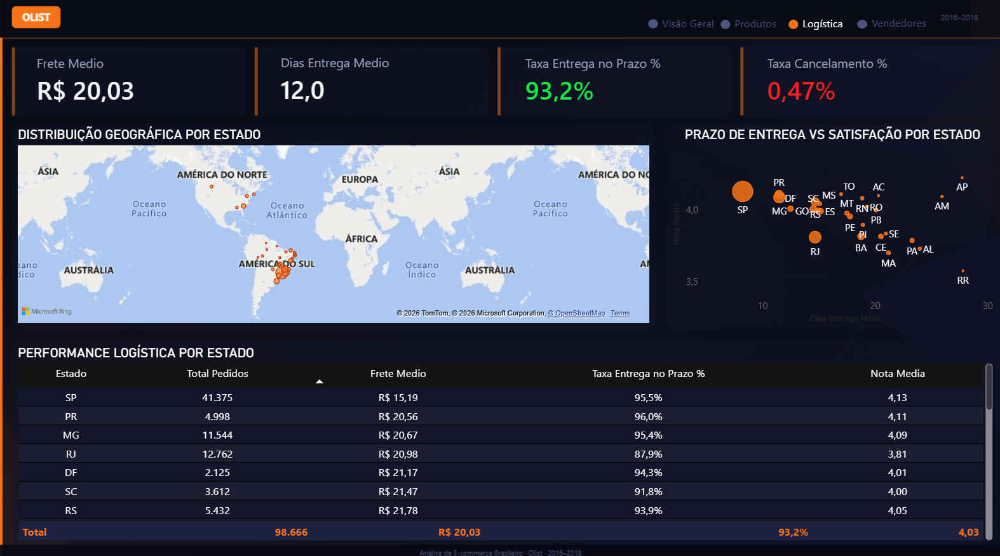
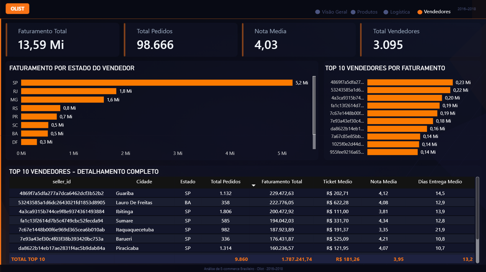

<div align="center">

<br>

<h1>📦 Análise de E-commerce Brasileiro — Olist</h1>

<p>Pipeline de dados completo: da extração ao dashboard executivo interativo</p>

<br>


&nbsp;

&nbsp;

&nbsp;


<br><br>

</div>

---

<br>

<h2>🎯 Sobre o Projeto</h2>

<br>

<p>
A <strong>Olist</strong> é o maior marketplace de departamentos do Brasil, conectando pequenos lojistas a grandes redes de e-commerce.
Este projeto simula o trabalho de um <strong>Analista de Dados</strong> respondendo perguntas reais de negócio
usando dados de <strong>~100 mil pedidos realizados entre 2016 e 2018</strong>.
</p>

<br>

<p>
O projeto foi construído do zero como portfólio prático, cobrindo todo o ciclo de dados:
</p>

<br>

<blockquote>
<strong>Coleta → Limpeza → Modelagem → Análise SQL → Visualização no Power BI</strong>
</blockquote>

<br>

<p>O que diferencia este projeto de outros portfólios:</p>

<ul>
  <li>Pipeline ETL completo e documentado em Python</li>
  <li>Modelagem dimensional com Esquema Estrela no SQL Server</li>
  <li>SQL avançado com CTEs e Window Functions respondendo perguntas reais de negócio</li>
  <li>Dashboard executivo com design profissional, tooltips interativos e navegação entre páginas</li>
  <li>Dados 100% reais de uma empresa brasileira, sem dados sintéticos</li>
</ul>

<h2>🔗 Acesse o Projeto</h2>

<br>

<p>
  <a href="https://app.powerbi.com/view?r=eyJrIjoiNzRhNzRlNDEtYTA5NS00MzYzLTlhNTktMWFhYjIyZDg4MGYyIiwidCI6ImFkOGRhY2IwLWU2OTgtNDJkZC04ODY2LWFkYWRkZTQ3MTEwZCJ9">
    👉 Clique aqui para acessar o dashboard interativo no Power BI
  </a>
</p>

---

<br>

<h2>📸 Dashboard</h2>

<br>

<h3>Visão Geral</h3>

<br>



<br><br>

<h3>Produtos</h3>

<br>



<br><br>

<h3>Logística</h3>

<br>



<br><br>

<h3>Vendedores</h3>

<br>



<br>

---

<br>

<h2>🛠️ Tecnologias Utilizadas</h2>

<br>

<table>
  <thead>
    <tr>
      <th>Tecnologia</th>
      <th>Versão</th>
      <th>Uso no Projeto</th>
    </tr>
  </thead>
  <tbody>
    <tr>
      <td><strong>Python</strong> + pandas</td>
      <td>3.12</td>
      <td>Extração, limpeza e transformação dos dados (ETL)</td>
    </tr>
    <tr>
      <td><strong>SQLAlchemy</strong> + pyodbc</td>
      <td>latest</td>
      <td>Conexão Python → SQL Server para carga automatizada</td>
    </tr>
    <tr>
      <td><strong>SQL Server</strong> + T-SQL</td>
      <td>2022</td>
      <td>Modelagem dimensional e queries analíticas</td>
    </tr>
    <tr>
      <td><strong>CTEs + Window Functions</strong></td>
      <td>—</td>
      <td>Ranking, acumulado, variação MoM/YoY, LAG/LEAD</td>
    </tr>
    <tr>
      <td><strong>Power BI</strong> + DAX</td>
      <td>latest</td>
      <td>Dashboard executivo com 15 medidas e tooltips interativos</td>
    </tr>
    <tr>
      <td><strong>Git + GitHub</strong></td>
      <td>—</td>
      <td>Versionamento e publicação do portfólio</td>
    </tr>
  </tbody>
</table>

<br>

---

<br>

<h2>🔄 Pipeline de Dados</h2>

<br>

```
9 CSVs brutos — dataset real Olist (~100k pedidos)
        │
        ▼
01_exploracao.py
   → Análise exploratória das 9 tabelas
   → Identificação de nulos, outliers e inconsistências
   → Mapeamento dos relacionamentos entre tabelas
        │
        ▼
02_limpeza.py
   → Conversão de 5 colunas de data: str → datetime
   → Padronização de cidades para title case
   → Tratamento de nulos com mediana
   → Geolocalização: 1.000.163 → 19.015 linhas (1 por CEP)
        │
        ▼
03_carga_sql.py
   → Modelagem dimensional — Esquema Estrela
   → Geração automática de dim_tempo com pd.date_range()
   → Cálculo de métricas: dias_para_entregar, dias_de_atraso
   → Carga no SQL Server: 5 tabelas | 248.927 linhas totais
        │
        ▼
SQL Server — banco olist_dw
   → dim_tempo · dim_clientes · dim_produtos
   → dim_vendedores · fato_pedidos
        │
        ▼
Power BI — Dashboard Executivo
   → 4 páginas · 15 medidas DAX · tooltips interativos · navegação
```

<br>

---

<br>

<h2>🗄️ Modelagem Dimensional — Esquema Estrela</h2>

<br>

```
   dim_clientes (99.441)         dim_produtos (32.951)
          \                            /
           \                          /
            \                        /
             fato_pedidos (112.650)
            /                        \
           /                          \
          /                            \
  dim_vendedores (3.095)          dim_tempo (774)
```

<br>

<p><strong>Principais decisões técnicas:</strong></p>

<br>

<ul>
  <li><strong>Surrogate Keys (INT)</strong> em todas as dimensões — JOINs mais rápidos que comparar VARCHAR(50)</li>
  <li><strong>Geolocalização agregada</strong> por média de coordenadas por CEP — eliminou 98% das duplicatas</li>
  <li><strong>dim_tempo gerada via Python</strong> com <code>pd.date_range()</code> — suporte nativo a filtros de calendário no Power BI</li>
  <li><strong>Métricas calculadas no ETL</strong> — <code>dias_para_entregar</code> e <code>dias_de_atraso</code> para melhor performance no modelo</li>
</ul>

<br>

---

<br>

<h2>📊 SQL Avançado — Queries de Negócio</h2>

<br>

<table>
  <thead>
    <tr>
      <th>Query</th>
      <th>Técnica SQL</th>
      <th>Pergunta Respondida</th>
    </tr>
  </thead>
  <tbody>
    <tr>
      <td>Faturamento mensal</td>
      <td><code>GROUP BY</code> + <code>JOIN</code></td>
      <td>Existe sazonalidade nas vendas?</td>
    </tr>
    <tr>
      <td>Top 10 categorias</td>
      <td><code>JOIN</code> multitabela</td>
      <td>Quais categorias lideram em receita?</td>
    </tr>
    <tr>
      <td>Performance por estado</td>
      <td>Agregações + <code>JOIN</code></td>
      <td>O frete e prazo variam entre regiões?</td>
    </tr>
    <tr>
      <td>Top 10 vendedores</td>
      <td><strong>CTE</strong></td>
      <td>Quais vendedores merecem destaque?</td>
    </tr>
    <tr>
      <td>Ranking por estado</td>
      <td><strong>CTE + RANK() OVER PARTITION BY</strong></td>
      <td>Quem é o top vendedor em cada UF?</td>
    </tr>
    <tr>
      <td>Faturamento acumulado</td>
      <td><strong>SUM() OVER + LAG()</strong></td>
      <td>Qual foi o crescimento ao longo do tempo?</td>
    </tr>
  </tbody>
</table>

<br>

<p><strong>Exemplo — Window Function com CTE:</strong></p>

<br>

```sql
WITH faturamento_vendedor AS (
    SELECT
        v.estado,
        v.seller_id,
        v.cidade,
        ROUND(SUM(f.valor_produto), 2) AS faturamento,
        COUNT(DISTINCT f.order_id)     AS total_pedidos
    FROM fato_pedidos f
    JOIN dim_vendedores v ON f.sk_vendedor = v.sk_vendedor
    WHERE f.status_pedido NOT IN ('canceled', 'unavailable')
    GROUP BY v.estado, v.seller_id, v.cidade
)
SELECT *,
    RANK() OVER (
        PARTITION BY estado
        ORDER BY faturamento DESC
    ) AS ranking_no_estado
FROM faturamento_vendedor
ORDER BY estado, ranking_no_estado;
```

<br>

---

<br>

<h2>🔍 Principais Insights Encontrados</h2>

<br>

<h3>📅 Sazonalidade e Crescimento</h3>

<br>

<ul>
  <li><strong>Black Friday 2017:</strong> novembro cresceu <strong>+52%</strong> sobre outubro — primeiro mês a ultrapassar R$ 1 milhão de faturamento</li>
  <li>Volume cresceu <strong>813% em 12 meses</strong> com ticket médio estável entre R$110 e R$133 — crescimento por aquisição de clientes, não por desconto</li>
</ul>

<br>

<h3>📦 Produtos</h3>

<br>

<ul>
  <li><strong>health_beauty</strong> lidera em volume mas <strong>watches_gifts</strong> tem maior ticket médio (R$214 vs R$142) — maior potencial de receita por pedido</li>
  <li><strong>bed_bath_table</strong> tem a menor nota (3,90) com o maior volume — alto impacto negativo no NPS da plataforma</li>
  <li><strong>cool_stuff</strong> com ticket médio de R$164 e volume baixo — nicho com alto potencial de crescimento</li>
</ul>

<br>

<h3>🚚 Logística e Regiões</h3>

<br>

<ul>
  <li><strong>SP</strong> concentra 41% dos pedidos com menor frete (R$15,19), menor prazo (8,3 dias) e maior nota (4,13)</li>
  <li><strong>Correlação negativa confirmada:</strong> quanto maior o prazo de entrega, menor a nota — SP: 8 dias (nota 4,13) vs MA: 21 dias (nota 3,70)</li>
  <li>Nordeste e Norte pagam frete <strong>2 a 3x maior</strong> que SP — evidência direta para política de subsídio regional</li>
</ul>

<br>

<h3>🏆 Vendedores</h3>

<br>

<ul>
  <li><strong>Lauro de Freitas-BA:</strong> único top 5 fora de SP com R$222k em apenas 358 pedidos e ticket médio de <strong>R$543</strong></li>
  <li><strong>Itaquaquecetuba-SP:</strong> R$187k de faturamento mas nota <strong>3,35</strong> e <strong>21,9 dias</strong> de prazo — pior experiência do top 10</li>
  <li>8 dos top 10 vendedores estão em SP — vantagem logística de proximidade confirmada pelos dados</li>
</ul>

<br>

---

<br>

<h2>📁 Estrutura do Repositório</h2>

<br>

```
analise-ecommerce-olist/
│
├── notebooks/
│   ├── 01_exploracao.py          ← Análise exploratória das 9 tabelas
│   ├── 02_limpeza.py             ← Tratamento e padronização dos dados
│   └── 03_carga_sql.py           ← Modelagem dimensional + carga SQL Server
│
├── sql/
│   └── analises_negocio.sql      ← 6 queries com CTEs e Window Functions
│
├── prints/
│   ├── 01_visao_geral.png
│   ├── 02_produtos.png
│   ├── 03_logistica.png
│   └── 04_vendedores.png
│
├── tema_olist.json               ← Tema dark + laranja para Power BI
├── analise-ecommerce-olist.pbix  ← Dashboard Power BI completo
├── .gitignore
└── README.md
```

<br>

---

<br>

<h2>▶️ Como Reproduzir o Projeto</h2>

<br>

<p><strong>Pré-requisitos:</strong> Python 3.10+, SQL Server Developer Edition (gratuito), Power BI Desktop (gratuito)</p>

<br>

```bash
# 1. Clonar o repositório
git clone https://github.com/BrendonSantos7/analise-ecommerce-olist.git
cd analise-ecommerce-olist

# 2. Instalar dependências Python
pip install pandas sqlalchemy pyodbc

# 3. Baixar o dataset (gratuito, sem login necessário)
# Acesse: https://github.com/olist/work-at-olist-data
# Extraia os 9 CSVs na pasta data/raw/

# 4. Executar o pipeline na ordem
python notebooks/01_exploracao.py
python notebooks/02_limpeza.py
python notebooks/03_carga_sql.py

# 5. Abrir o dashboard
# Abrir analise-ecommerce-olist.pbix no Power BI Desktop
# Atualizar a conexão: localhost > olist_dw > Autenticação Windows
```

<br>

---

<br>

<h2>✅ Competências Demonstradas</h2>

<br>

<ul>
  <li>✔️ Python para ETL e análise exploratória (pandas, SQLAlchemy, pathlib)</li>
  <li>✔️ Modelagem dimensional — Esquema Estrela (fato + 4 dimensões)</li>
  <li>✔️ SQL Server / T-SQL avançado (CTEs, Window Functions, JOINs, Views)</li>
  <li>✔️ Pipeline de dados ponta a ponta: raw → clean → dimensional → visual</li>
  <li>✔️ Power BI com 15 medidas DAX e dashboard executivo interativo</li>
  <li>✔️ Inteligência de tempo em DAX (YoY, MoM, YTD, variação acumulada)</li>
  <li>✔️ Tooltips de página personalizados e navegação interativa entre páginas</li>
  <li>✔️ Storytelling de dados com raciocínio de negócio</li>
  <li>✔️ Documentação técnica profissional e Git/GitHub</li>
</ul>

<br>

---

<br>

<h2>👨‍💻 Autor</h2>

<br>

<p>
  <strong>Brendon Santos</strong>
</p>

<br>

<p>
Profissional em transição de carreira para Análise de Dados, com experiência prévia em SQL Server, Excel e Power BI.
Este projeto foi desenvolvido integralmente para demonstrar competências práticas no ciclo completo de dados —
da ingestão até a visualização — usando dados reais de uma empresa brasileira.
</p>

<br>

<a href="https://www.linkedin.com/in/brendongomessantos/">
  
</a>
&nbsp;
<a href="https://github.com/BrendonSantos7">
  
</a>

<br><br>

---

<br>

<div align="center">

<p>
  <em>
    Dataset: <a href="https://github.com/olist/work-at-olist-data">Olist — work-at-olist-data</a>
    · Dados reais de e-commerce brasileiro (2016–2018)
  </em>
</p>

<br>

</div>
